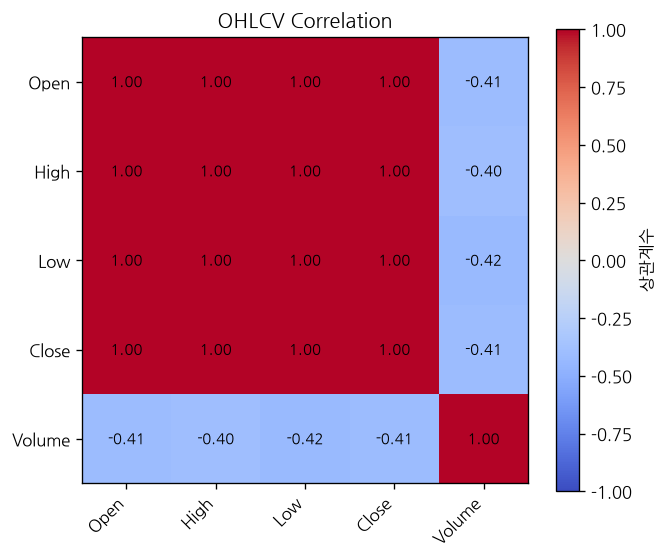
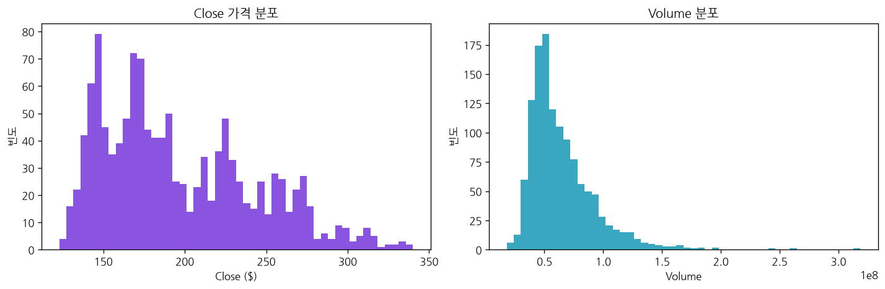
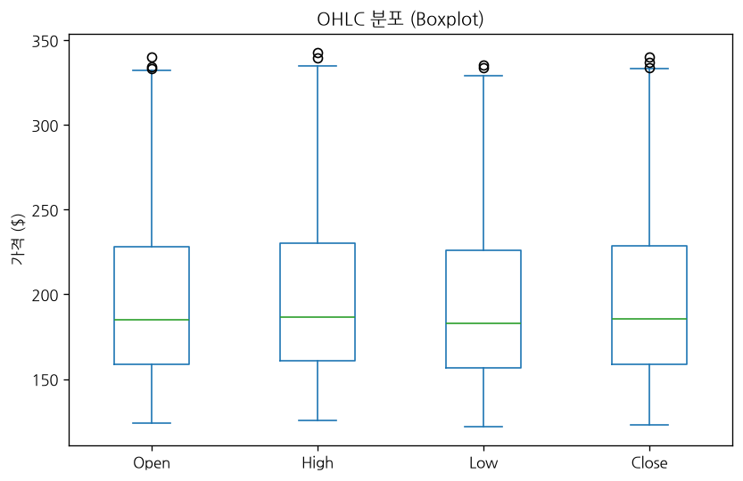
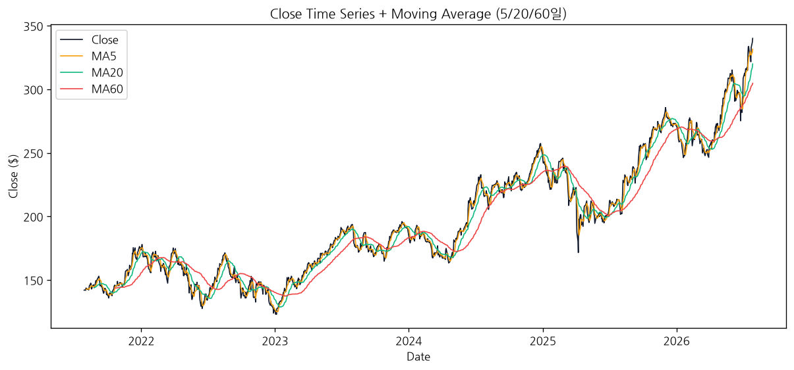
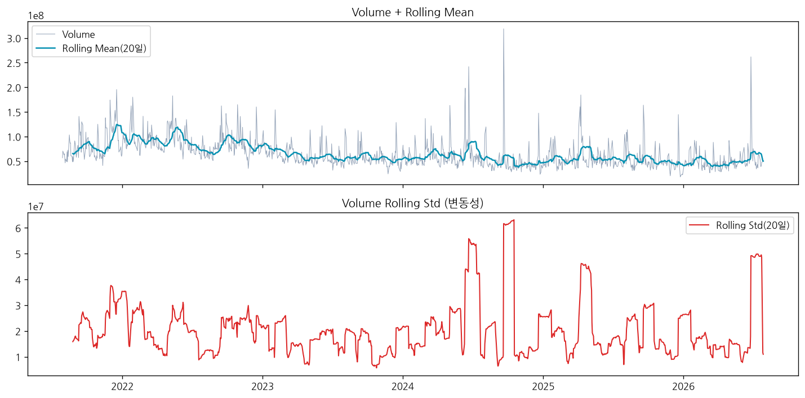
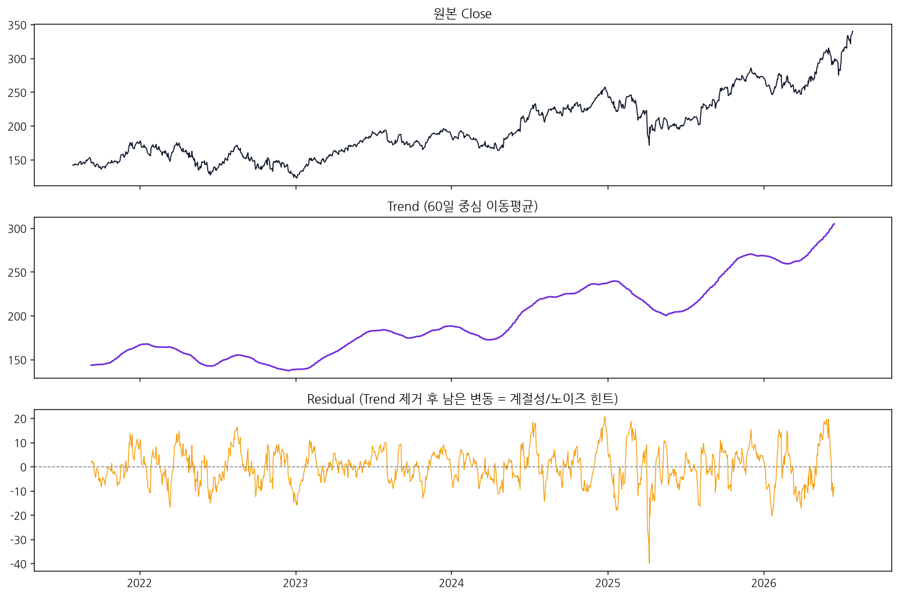

# EDA Report — AAPL

- 데이터 기간: 2021-07-29 ~ 2026-07-28
- Shape: 1254행 x 5열
- 결측치: 0개
- 중복 행: 0개

## Info (컬럼/자료형)

| 컬럼 | 자료형 | 결측치 |
|---|---|---|
| Open | float64 | 0 |
| High | float64 | 0 |
| Low | float64 | 0 |
| Close | float64 | 0 |
| Volume | int64 | 0 |

## Describe (기초 통계량)

|       |      Open |      High |       Low |     Close |         Volume |
|:------|----------:|----------:|----------:|----------:|---------------:|
| count | 1254      | 1254      | 1254      | 1254      | 1254           |
| mean  |  196.231  |  198.405  |  194.301  |  196.448  |    6.46315e+07 |
| std   |   46.8739 |   47.3303 |   46.5095 |   46.9538 |    2.85076e+07 |
| min   |  123.907  |  125.638  |  122.098  |  122.934  |    1.79106e+07 |
| 25%   |  158.51   |  160.64   |  156.378  |  158.512  |    4.55228e+07 |
| 50%   |  184.871  |  186.587  |  182.852  |  185.283  |    5.63727e+07 |
| 75%   |  228.266  |  230.394  |  226.052  |  228.435  |    7.63509e+07 |
| max   |  340.03   |  342.89   |  335.6    |  340.08   |    3.1868e+08  |

## Correlation (OHLCV 상관관계)

|        |   Open |   High |    Low |   Close |   Volume |
|:-------|-------:|-------:|-------:|--------:|---------:|
| Open   |  1     |  0.999 |  0.999 |   0.998 |   -0.414 |
| High   |  0.999 |  1     |  0.999 |   0.999 |   -0.398 |
| Low    |  0.999 |  0.999 |  1     |   0.999 |   -0.424 |
| Close  |  0.998 |  0.999 |  0.999 |   1     |   -0.41  |
| Volume | -0.414 | -0.398 | -0.424 |  -0.41  |    1     |

## Close / Volume 분포

## OHLC Boxplot

## Close Time Series + Moving Average

## Volume Rolling Mean/Std

## Trend / Seasonality

